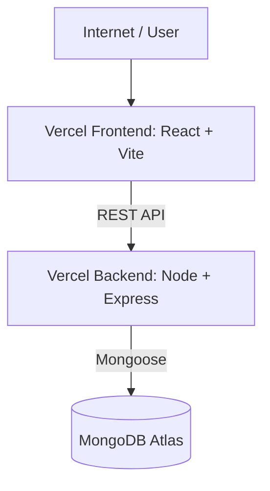

# 1Fi Assignment

Live Demo: [https://1fi-rajneesh.vercel.app/](https://1fi-rajneesh.vercel.app/)

Demo Video: [https://drive.google.com/file/d/1OhvFdN7iF0ynwGnM2wA9QCxUFU4J4Wxv/view?usp=sharing](https://drive.google.com/file/d/1OhvFdN7iF0ynwGnM2wA9QCxUFU4J4Wxv/view?usp=sharing)

GitHub: [https://github.com/RajneeshYadav-123/1Fi_Assignment](https://github.com/RajneeshYadav-123/1Fi_Assignment)

Backend API: [https://frontend-ten-ochre-72.vercel.app/api/products](https://frontend-ten-ochre-72.vercel.app/api/products)


## Project Overview

The data for all the products lives in a MongoDB Atlas database. It's served up through a Node.js and Express REST API that I built. On the frontend, a React application consumes this API to dynamically render everything you see on the screen. Both the frontend and backend are hosted on Vercel for easy access.

### Key Features
- **Product browsing:** A main listing page and detailed individual product pages.
- **Dynamic Data:** Everything is fetched live from MongoDB.
- **Variant Selection:** You can pick specific product variants, like different colors and storage capacities.
- **EMI Integration:** The app shows multiple EMI options, including interest rates, cashback details, and highlights the most popular plans.
- **Pricing Details:** Clearly shows the Maximum Retail Price (MRP) alongside the discounted selling price.
- **Checkout Flow:** Includes a mock checkout process to simulate a real purchase.
- **Responsive:** The design looks great and works well on both desktop and mobile devices.
- **API & DB:** Includes a fully functional REST API backed by a MongoDB database.

---

## Tech Stack

Here's a quick look at the technologies I used to build this:

| Frontend | Backend | Database & Deployment |
| :--- | :--- | :--- |
| **React** | **Node.js** | **MongoDB Atlas** |
| **Vite** | **Express.js** | **Vercel** |
| **JavaScript** | **JavaScript** | |
| **Tailwind CSS** | **Mongoose** | |
| **React Router** | **dotenv & CORS** | |
| **Axios** | | |

---

## Architecture

Here is how the different pieces of the application communicate with each other:



The React frontend talks to the Express backend using standard HTTP REST API calls. The backend then uses Mongoose to handle all the interactions with the MongoDB Atlas database.

---

## Project Structure

If you want to explore the code, here's a high-level view of how the project is organized:

```text
1Fi_Assignment/
├── client/                 # React Frontend
│   ├── public/
│   ├── src/
│   │   ├── components/
│   │   ├── pages/
│   │   ├── services/
│   │   ├── utils/
│   │   ├── App.jsx
│   │   ├── main.jsx
│   │   └── index.css
│   ├── package.json
│   └── vite.config.js
│
├── server/                 # Node.js Backend
│   ├── src/
│   │   ├── config/
│   │   ├── controllers/
│   │   ├── models/
│   │   ├── routes/
│   │   ├── seed/
│   │   ├── app.js
│   │   └── server.js
│   ├── package.json
│   ├── vercel.json
│   └── .env.example
│
└── package.json
```

---

## Database Schema

I'm using a single `Product` collection in MongoDB to keep things simple and efficient.

### Product Collection

| Field | Type | Description |
| :--- | :--- | :--- |
| `name` | String | The name of the product |
| `slug` | String | A unique, URL-friendly identifier |
| `brand` | String | The brand of the product |
| `description` | String | A detailed description |
| `mrp` | Number | The maximum retail price |
| `price` | Number | The actual selling price |
| `images` | Array | A list of URLs for the product images |
| `variants` | Array | Available product options (like Color, Storage) |
| `emiPlans` | Array | The different EMI plans available for the product |

**Note:** I decided to embed the variants and EMI plans directly inside the product document. This makes it really straightforward to get all the information needed for a product details page in just a single API request, rather than making multiple calls.

---

## API Documentation

If you want to interact with the backend directly, here are the available endpoints.

### Health Check
`GET /api/health`
A simple endpoint to verify that the backend is up and running.

```json
{
  "success": true,
  "message": "API is running successfully"
}
```

### Get All Products
`GET /api/products`
Fetches a list of all products, providing summary information for the listing page.

```json
{
  "success": true,
  "data": [
    {
      "_id": "60d21b4667d0d8992e610c85",
      "name": "Apple iPhone 17 Pro",
      "slug": "iphone-17-pro",
      "brand": "Apple",
      "mrp": 134900,
      "price": 127400,
      "images": ["url"]
    }
  ]
}
```

### Get Product by Slug
`GET /api/products/:slug`
Fetches the complete details for a specific product, including its variants and EMI plans.

```json
{
  "success": true,
  "data": {
    "_id": "60d21b4667d0d8992e610c85",
    "name": "Apple iPhone 17 Pro",
    "slug": "iphone-17-pro",
    "price": 127400,
    "variants": [],
    "emiPlans": []
  }
}
```

---

## Local Setup

Want to run this on your own machine? Follow these steps.

### Prerequisites
Before you start, make sure you have:
- Node.js and npm installed
- A MongoDB Atlas account (or a local MongoDB instance)

### 1. Clone the Repository
First, grab the code from GitHub:
```bash
git clone https://github.com/RajneeshYadav-123/1Fi_Assignment.git
cd 1Fi_Assignment
```

### 2. Install Dependencies
Next, install the required packages for both the frontend and backend:
```bash
npm run install:all
```

### 3. Configure Environment Variables
You'll need to set up some environment variables. Create these `.env` files in their respective directories. Please remember not to commit these files to version control!

**Backend** (Create a file at `server/.env`)
```env
PORT=5000
MONGODB_URI=your_mongodb_atlas_connection_string
CLIENT_URL=http://localhost:5173
```

**Frontend** (Create a file at `client/.env`)
```env
VITE_API_URL=http://localhost:5000
```

### 4. Seed the Database
Let's populate your database with some sample data so you have something to look at:
```bash
npm run seed
```
This script adds the sample products, their variants, and EMI plans to your MongoDB database.

### 5. Start the Application
Finally, start up both the frontend and backend servers:
```bash
npm run dev
```
You should now be able to view the app in your browser:
- **Frontend:** http://localhost:5173
- **Backend:** http://localhost:5000

---

## Deployment

I've deployed both parts of this project using Vercel. It's split into two separate Vercel projects for easier management.

- **Frontend Deployment:** This is deployed directly from the `client` folder. I configured it to point to the live backend using the `VITE_API_URL` environment variable. You can view the live site [here](https://1fi-rajneesh.vercel.app/).
- **Backend Deployment:** This is deployed from the `server` folder, with its configuration defined in `server/vercel.json`. You can access the live API [here](https://frontend-ten-ochre-72.vercel.app/api/products).

---

## Future Improvements

If I had more time, here are a few things I'd love to add or improve:

- [ ] Implement user authentication and authorization so users can have accounts.
- [ ] Integrate a real payment gateway, like Stripe or Razorpay, for the checkout flow.
- [ ] Build an admin dashboard to easily manage the product catalog and inventory.
- [ ] Add order management capabilities and a user order history page.
- [ ] Write comprehensive unit and integration tests to ensure reliability.
- [ ] Improve API request validation and overall error handling.
- [ ] Set up caching to serve frequently requested product data faster.
- [ ] Implement production monitoring and more structured logging.
