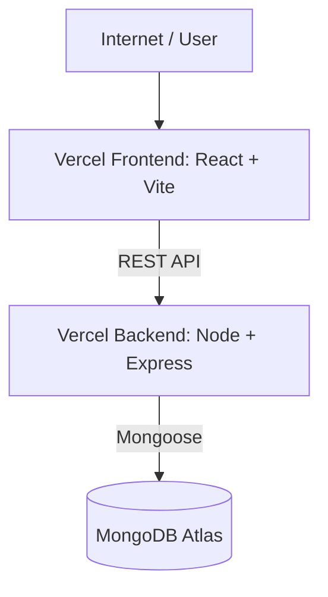

# 1Fi Assignment

Live Demo: [https://1fi-rajneesh.vercel.app/](https://1fi-rajneesh.vercel.app/)

Demo Video: [https://drive.google.com/file/d/1OhvFdN7iF0ynwGnM2wA9QCxUFU4J4Wxv/view?usp=sharing](https://drive.google.com/file/d/1OhvFdN7iF0ynwGnM2wA9QCxUFU4J4Wxv/view?usp=sharing)

GitHub: [https://github.com/RajneeshYadav-123/1Fi_Assignment](https://github.com/RajneeshYadav-123/1Fi_Assignment)

Backend API: [https://frontend-ten-ochre-72.vercel.app/api/products](https://frontend-ten-ochre-72.vercel.app/api/products)


## 📖 Project Overview

Product data is stored in **MongoDB Atlas** and accessed through a **Node.js** and **Express** REST API. The **React** frontend consumes these APIs and dynamically renders the product information. Both the frontend and backend are deployed on **Vercel**.

### ✨ Features
- **Product browsing:** Product listing and detailed product pages.
- **Dynamic Data:** Dynamic product data fetched from MongoDB.
- **Variant Selection:** Product variant selection such as color and storage.
- **EMI Integration:** Multiple EMI plan options with interest rate and cashback information, including popular EMI plan indication.
- **Pricing Details:** Product pricing with MRP and discounted price.
- **Checkout Flow:** Demo checkout flow.
- **Responsive:** Responsive design for desktop and mobile.
- **API & DB:** REST API for products and health checks, backed by MongoDB.

---

## 🛠️ Tech Stack

| Frontend | Backend | Database & Deployment |
| :--- | :--- | :--- |
| ⚛️ **React** | 🟢 **Node.js** | 🍃 **MongoDB Atlas** |
| ⚡ **Vite** | 🚂 **Express.js** | ▲ **Vercel** |
| 🟨 **JavaScript** | 🟨 **JavaScript** | |
| 🎨 **Tailwind CSS** | 🗄️ **Mongoose** | |
| 🛣️ **React Router** | 🔐 **dotenv & CORS** | |
| 📡 **Axios** | | |

---

## 🏗️ Architecture



The frontend communicates with the Express backend through HTTP REST APIs. The backend uses Mongoose to interact with MongoDB Atlas.

---

## 🗂️ Project Structure

```text
1Fi_Assignment/
├── client/                 # React Frontend
│   ├── public/
│   ├── src/
│   │   ├── components/
│   │   ├── pages/
│   │   ├── services/
│   │   ├── utils/
│   │   ├── App.jsx
│   │   ├── main.jsx
│   │   └── index.css
│   ├── package.json
│   └── vite.config.js
│
├── server/                 # Node.js Backend
│   ├── src/
│   │   ├── config/
│   │   ├── controllers/
│   │   ├── models/
│   │   ├── routes/
│   │   ├── seed/
│   │   ├── app.js
│   │   └── server.js
│   ├── package.json
│   ├── vercel.json
│   └── .env.example
│
└── package.json
```

---

## 🗃️ Database Schema

The application uses a `Product` collection in MongoDB.

### 📦 Product

| Field | Type | Description |
| :--- | :--- | :--- |
| `name` | String | Product name |
| `slug` | String | Unique URL-friendly identifier |
| `brand` | String | Product brand |
| `description` | String | Product description |
| `mrp` | Number | Maximum retail price |
| `price` | Number | Selling price |
| `images` | Array | Product image URLs |
| `variants` | Array | Available product variants (e.g. Color, Storage) |
| `emiPlans` | Array | Available EMI plans |

> **Note:** Keeping variants and EMI plans inside the product document makes it straightforward to retrieve all the information required for a product details page in a single API request.

---

## 📚 API Documentation

### 🟢 Health Check
`GET /api/health`
Used to verify that the backend is running successfully.

```json
{
  "success": true,
  "message": "API is running successfully"
}
```

### 🛍️ Get All Products
`GET /api/products`
Returns a list of products with summary information.

```json
{
  "success": true,
  "data": [
    {
      "_id": "60d21b4667d0d8992e610c85",
      "name": "Apple iPhone 17 Pro",
      "slug": "iphone-17-pro",
      "brand": "Apple",
      "mrp": 134900,
      "price": 127400,
      "images": ["url"]
    }
  ]
}
```

### 🔍 Get Product by Slug
`GET /api/products/:slug`
Returns complete product information including variants and EMI plans.

```json
{
  "success": true,
  "data": {
    "_id": "60d21b4667d0d8992e610c85",
    "name": "Apple iPhone 17 Pro",
    "slug": "iphone-17-pro",
    "price": 127400,
    "variants": [],
    "emiPlans": []
  }
}
```

---

## 🚀 Local Setup

### Prerequisites
Make sure you have installed:
- Node.js & npm
- MongoDB Atlas account

### 1. Clone the Repository
```bash
git clone https://github.com/RajneeshYadav-123/1Fi_Assignment.git
cd 1Fi_Assignment
```

### 2. Install Dependencies
```bash
npm run install:all
```

### 3. Configure Environment Variables
Create the required `.env` files. **Do not commit `.env` files or database credentials to GitHub.**

**Backend** (`server/.env`)
```env
PORT=5000
MONGODB_URI=your_mongodb_atlas_connection_string
CLIENT_URL=http://localhost:5173
```

**Frontend** (`client/.env`)
```env
VITE_API_URL=http://localhost:5000
```

### 4. Seed the Database
```bash
npm run seed
```
This adds the sample products, variants, and EMI plans to MongoDB.

### 5. Start the Application
```bash
npm run dev
```
The application will be available at:
- **Frontend:** http://localhost:5173
- **Backend:** http://localhost:5000

---

## ☁️ Deployment

The project is deployed using two separate **Vercel** projects.

- **Frontend Deployment:** Deployed from `client` directory. Uses `VITE_API_URL=https://frontend-ten-ochre-72.vercel.app`. [Live Link](https://1fi-rajneesh.vercel.app/)
- **Backend Deployment:** Deployed from `server` directory. Configured via `server/vercel.json`. [API Link](https://frontend-ten-ochre-72.vercel.app/api/products)

---

## 🔮 Future Improvements

- [ ] Add user authentication and authorization.
- [ ] Integrate a real payment gateway such as Razorpay or Stripe.
- [ ] Add an admin dashboard for product and inventory management.
- [ ] Add order management and order history.
- [ ] Add automated unit and integration tests.
- [ ] Add API validation and improved error handling.
- [ ] Add caching for frequently requested product data.
- [ ] Add production monitoring and structured logging.
